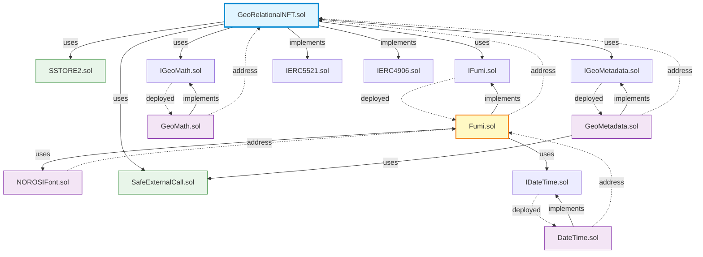

# NOROSI Smart Contracts

地理座標ベースのNFT（GeoRelationalNFT）のスマートコントラクト実装です。

## 📋 目次

- [概要](#概要)
- [アーキテクチャ](#アーキテクチャ)
- [主要コントラクト](#主要コントラクト)
- [ライブラリ](#ライブラリ)
- [インターフェース](#インターフェース)
- [デプロイメント](#デプロイメント)
- [開発](#開発)

---

## 概要

このパッケージは、**NOROSI**ブランドの地理座標ベースNFTシステムを実装するスマートコントラクト群です。

### 主な機能

- 🗺️ **地理座標エンコーディング**: TokenIDに緯度・経度を埋め込み（ミリオンス単位）
- 🔗 **ERC-5521 Referable NFT**: トークン間の双方向参照関係
- 🎨 **オンチェーンSVG生成**: 9-12KBの動的SVGを完全オンチェーンで生成
- 📍 **4レベルH3ジオスパーシャルインデックス**: r6/r8/r10/r12の多解像度検索
- 🔐 **EIP-712署名ミント**: ガスレスミントのための構造化データ署名
- 💾 **ハイブリッドテキストストレージ**: 54バイト以下はインライン、55バイト以上はSSTORE2

### トークン標準

- **ERC-721**: 基本的なNFT機能
- **ERC-721 Enumerable**: トークン列挙サポート
- **ERC-5521**: 参照可能NFT（双方向参照）
- **ERC-4906**: メタデータ更新イベント

---

## アーキテクチャ

### 依存関係図



### ASCII版アーキテクチャ図

```
┌─────────────────────────────────────────────────────────────────┐
│                     GeoRelationalNFT.sol                        │
│                         (Main NFT)                              │
│                                                                 │
│  ・ERC-721 + Enumerable                                         │
│  ・ERC-5521 (Referable NFT)                                     │
│  ・ERC-4906 (Metadata Update)                                   │
│  ・EIP-712 (Signed Minting)                                     │
└───────────┬──────────────┬────────────┬───────────┬────────────┘
            │              │            │           │
            ▼              ▼            ▼           ▼
    ┌───────────┐  ┌──────────┐  ┌──────────┐  ┌─────────┐
    │   Fumi    │  │ GeoMath  │  │GeoMetadata│  │ SSTORE2 │
    │  (SVG)    │  │(Distance)│  │ (Format) │  │ (Text)  │
    └─────┬─────┘  └──────────┘  └────┬─────┘  └─────────┘
          │                            │
          ▼                            ▼
    ┌──────────┐              ┌──────────────┐
    │ DateTime │              │SafeExternal  │
    │(Convert) │              │Call (Safe)   │
    └──────────┘              └──────────────┘
          ▲
          │
    ┌───────────┐
    │NOROSIFont │
    │  (Font)   │
    └───────────┘
```

### レイヤー構造

```
┌─────────────────────────────────────────┐
│    Layer 4: Application (Main NFT)      │  ← GeoRelationalNFT.sol
├─────────────────────────────────────────┤
│    Layer 3: Logic (Business Logic)      │  ← Fumi.sol, GeoMath.sol, GeoMetadata.sol
├─────────────────────────────────────────┤
│    Layer 2: Data (Resources)            │  ← NOROSIFont.sol, DateTime.sol
├─────────────────────────────────────────┤
│    Layer 1: Utilities (Libraries)       │  ← SSTORE2.sol, SafeExternalCall.sol
└─────────────────────────────────────────┘
```

---

## 主要コントラクト

### 1. GeoRelationalNFT.sol

**役割**: メインのNFTコントラクト

**機能**:
- 地理座標（緯度・経度・標高）をTokenIDにエンコード
- ERC-5521による双方向トークン参照関係の管理
- EIP-712署名を用いたガスレスミント
- ハイブリッドテキストストレージ（インライン/SSTORE2）
- 4レベルH3ジオスパーシャルインデックス（r6, r8, r10, r12）

**主要な状態変数**:
```solidity
// External Contracts (immutable)
IFumi public immutable fumi;          // SVG生成コントラクト
IGeoMath public immutable geoMath;    // 距離計算コントラクト
IGeoMetadata public immutable geoMetadata; // メタデータフォーマットコントラクト

// Geographic Data
mapping(uint256 => string) private _h3r6;     // H3解像度6
mapping(uint256 => string) private _h3r8;     // H3解像度8
mapping(uint256 => string) private _h3r10;    // H3解像度10
mapping(uint256 => string) private _h3r12;    // H3解像度12

// Token Attributes
mapping(uint256 => int256) private _tokenElevations;      // 標高
mapping(uint256 => uint256) private _tokenColorIndexes;   // 色インデックス (0-255)
mapping(uint256 => uint256) private _tokenTrees;          // ツリータイプ
mapping(uint256 => uint256) private _tokenGenerations;    // 世代番号

// Reference System (ERC-5521)
mapping(uint256 => Reference[]) private _tokenReferences;
mapping(address => mapping(uint256 => uint256[])) private _referredBy;

// Text Storage (Hybrid)
mapping(uint256 => string) private _texts;                // インライン (≤54 bytes)
mapping(uint256 => address) private _textPointers;        // SSTORE2 (≥55 bytes)
```

**TokenIDエンコーディング**:
```
tokenId = quadrant × 10^20 + |latitude| × 10^10 + |longitude|

Quadrant (象限):
  0: (+lat, +lon) - 北東
  1: (-lat, +lon) - 南東
  2: (+lat, -lon) - 北西
  3: (-lat, -lon) - 南西

例: 東京 (35.6789°, 139.7661°)
  → quadrant=0, lat=35678900, lon=139766100
  → tokenId = 0×10^20 + 35678900×10^10 + 139766100
```

**主要な関数**:
```solidity
// ミント
function mint(...) external onlyOwner whenNotPaused returns (uint256);
function mintWithChain(...) external onlyOwner whenNotPaused returns (uint256);

// 署名ミント (EIP-712)
function signedMint(..., bytes calldata signature) external whenNotPaused returns (uint256);
function signedMintWithChain(..., bytes calldata signature) external whenNotPaused returns (uint256);

// TokenIDエンコード/デコード
function encodeTokenId(int256 latitude, int256 longitude) public pure returns (uint256);
function decodeTokenId(uint256 tokenId) public view returns (DecodedTokenData memory);

// メタデータ
function tokenURI(uint256 tokenId) public view override returns (string memory);

// ERC-5521
function referredOf(address contractAddr, uint256 tokenId)
    external view returns (address[] memory, uint256[] memory);
```

**継承チェーン**:
```
GeoRelationalNFT
├─ ERC721 (OpenZeppelin)
├─ ERC721Enumerable (OpenZeppelin)
├─ IERC5521 (Custom)
├─ IERC4906 (Custom)
├─ Ownable (OpenZeppelin)
├─ Pausable (OpenZeppelin)
└─ EIP712 (OpenZeppelin)
```

**コントラクトサイズ**: ~23 KB（24KB制限内 ✅）

---

### 2. Fumi.sol

**役割**: オンチェーンSVG生成

**名前の由来**: "煙"（ふみ）- 波のような動的なビジュアルを生成

**機能**:
- 完全オンチェーンでの9-12KB SVG生成
- サイン波アニメーション（2703バイトのLUTを使用）
- 日付・時刻表示（DateTime連携）
- NOROSI カスタムフォント埋め込み
- 色の視覚化（colorIndex: 0-13）
- 参照カウント・世代番号バッジ

**主要な定数**:
```solidity
uint256 internal constant TWO_PI_1e4 = 62832;    // ≈ 2π × 10^4
uint256 internal constant STEP_1e4   = 137_931;  // 13.7931 × 10^4

// 2703バイトのサインLUT（Look-Up Table）
bytes constant SINE_LUT = hex"0000010203050608...";
```

**コンストラクタ依存**:
```solidity
constructor(address _datetimeAddress, address _norosiFontAddress) {
    datetime = IDateTime(_datetimeAddress);
    norosiFont = IFont(_norosiFontAddress);
}
```

**主要な関数**:
```solidity
function tokenSVG(TokenSVGParams memory params)
    external view returns (string memory);
```

**ガス最適化手法**:
- ✅ 大きなバッファへの直接書き込み（`abi.encodePacked`の繰り返し回避）
- ✅ サインLUTによる三角関数計算の高速化
- ✅ フェード係数の事前計算と再利用
- ✅ スタック深度エラー回避のための関数分割

**コントラクトサイズ**: ~12 KB

---

## ライブラリ

### 3. GeoMath.sol

**役割**: 地理座標間の距離計算

**機能**:
- 2点間の距離をメートル単位で計算
- テイラー級数近似による高速化: `cos(x) ≈ 1 - x²/2`
- 緯度による距離補正

**主要な関数**:
```solidity
function calculateDistance(
    int256 lat1, int256 lon1,
    int256 lat2, int256 lon2
) external pure returns (uint256);
```

**計算式**:
```
緯度差による距離: deltaLat × 111,132 meters/degree
経度差による距離: deltaLon × 111,132 × cos(avgLat) meters/degree
総距離: √(latDist² + lonDist²)
```

**コントラクトサイズ**: ~2 KB

---

### 4. GeoMetadata.sol

**役割**: メタデータのフォーマット処理

**機能**:
- 座標文字列のフォーマット（適切な小数点表示）
- 標高の地形分類（海底、平地、山岳など）
- 距離のkm変換と小数点表示
- 属性配列の生成
- レアリティ計算（極地、極端な標高など）

**主要な関数**:
```solidity
function formatMetadata(
    uint256 tokenId,
    DecodedTokenData memory data,
    string memory h3r6,
    string memory h3r8,
    string memory h3r10,
    string memory h3r12,
    uint256 totalDistance,
    uint256 refCount,
    uint256 timestamp
) external pure returns (MetadataResult memory);
```

**返り値**:
```solidity
struct MetadataResult {
    string name;              // "NOROSI #123"
    string description;       // 説明文
    string latitudeStr;       // "35.6789°N"
    string longitudeStr;      // "139.7661°E"
    string elevationStr;      // "10m (平地)"
    string distanceStr;       // "123.45 km"
    string attributes;        // JSON属性配列
}
```

**コントラクトサイズ**: ~8 KB

---

### 5. NOROSIFont.sol

**役割**: NOROSI ブランドカスタムフォントの提供

**機能**:
- `Norosi-Regular.woff2` (4040バイト) のBase64エンコード版を保存
- SVG内で使用するためのData URI形式で提供

**定数**:
```solidity
string public constant font =
    "data:application/font-woff2;charset=utf-8;base64,d09GMk9UVE8AAA/IAAk...";
```

**ファイル情報**:
- 元のファイル: `Norosi-Regular.woff2` (4040 bytes)
- Base64エンコード後: 5388 characters
- フォーマット: WOFF2 (Web Open Font Format 2)

**コントラクトサイズ**: ~11 KB

---

### 6. DateTime.sol

**役割**: Unixタイムスタンプから日付への変換

**機能**:
- Rata Dieアルゴリズムによる高速な日付計算
- 年・月・日の抽出

**主要な関数**:
```solidity
function timestampToDate(uint256 timestamp)
    internal pure returns (uint256 year, uint256 month, uint256 day);
```

**使用例**:
```solidity
(uint256 year, uint256 month, uint256 day) = DateTime.timestampToDate(1698765432);
// → (2023, 10, 31)
```

**コントラクトサイズ**: ~1 KB

---

### 7. SSTORE2.sol

**役割**: ガス効率的な不変データストレージ

**機能**:
- コントラクトバイトコードを利用した大きなデータの保存
- 55バイト以上のテキストに使用（インラインより効率的）

**主要な関数**:
```solidity
library SSTORE2 {
    function write(bytes memory data) internal returns (address pointer);
    function read(address pointer) internal view returns (bytes memory);
}
```

**動作原理**:
```
1. データをCREATE opcodeで新規コントラクトとしてデプロイ
2. コントラクトアドレスをポインタとして保存
3. 読み取り時はEXTCODECOPYでバイトコードを取得
```

**ガス効率**:
- 54バイト以下: インラインストレージが効率的
- 55バイト以上: SSTORE2が効率的（保存時コスト高、読み取り時安価）

**コントラクトサイズ**: ~0.5 KB

---

### 8. SafeExternalCall.sol

**役割**: 安全な外部コントラクト呼び出し

**機能**:
- 外部コントラクトへの静的呼び出しのラッパー
- エラーハンドリングの統一化
- ガス上限の設定

**主要な関数**:
```solidity
library SafeExternalCall {
    function safeStaticCall(address target, bytes memory data)
        internal view returns (bool success, bytes memory returnData);
}
```

**使用例**:
```solidity
(bool success, bytes memory data) =
    targetContract.safeStaticCall(abi.encodeWithSignature("getData()"));
```

**コントラクトサイズ**: <0.5 KB

---

## インタ��フェース

### IFumi.sol

Fumi.sol のインターフェース定義。

```solidity
interface IFumi {
    struct TokenSVGParams {
        uint256 tokenId;
        string text;
        uint256 colorIndex;
        uint256 refCount;
        uint256 timestamp;
        uint256 generation;
        uint256 treeIndex;
    }

    function tokenSVG(TokenSVGParams memory params)
        external view returns (string memory);
}
```

---

### IGeoMath.sol

GeoMath.sol のインターフェース定義。

```solidity
interface IGeoMath {
    function calculateDistance(
        int256 lat1, int256 lon1,
        int256 lat2, int256 lon2
    ) external pure returns (uint256);
}
```

---

### IGeoMetadata.sol

GeoMetadata.sol のインターフェース定義。

```solidity
interface IGeoMetadata {
    struct DecodedTokenData { ... }
    struct MetadataResult { ... }

    function formatMetadata(...)
        external pure returns (MetadataResult memory);
}
```

---

### IDateTime.sol

DateTime.sol のインターフェース定義。

```solidity
interface IDateTime {
    function timestampToDate(uint256 timestamp)
        external pure returns (uint256 year, uint256 month, uint256 day);
}
```

---

### IERC5521.sol

ERC-5521 (Referable NFT) の標準インターフェース。

```solidity
interface IERC5521 {
    event UpdateNode(
        address indexed contractAddr,
        uint256 indexed tokenId,
        address[] referAddresses,
        uint256[] referTokenIds
    );

    function referredOf(address contractAddr, uint256 tokenId)
        external view returns (address[] memory, uint256[] memory);
}
```

---

### IERC4906.sol

ERC-4906 (Metadata Update) の標準インターフェース。

```solidity
interface IERC4906 {
    event MetadataUpdate(uint256 _tokenId);
    event BatchMetadataUpdate(uint256 _fromTokenId, uint256 _toTokenId);
}
```

---

## デプロイメント

### デプロイ順序

コントラクト間の依存関係により、以下の順序でデプロイする必要があります：

```
1. DateTime.sol          (依存なし)
2. GeoMath.sol          (依存なし)
3. GeoMetadata.sol      (依存なし)
4. NOROSIFont.sol       (依存なし)
   ↓
5. Fumi.sol             (DateTime, NOROSIFont のアドレスが必要)
   ↓
6. GeoRelationalNFT.sol (Fumi, GeoMath, GeoMetadata のアドレスが必要)
```

### デプロイスクリプト

`scripts/deploy.ts` を使用します：

```bash
# Amoy テストネットにデプロイ
npx hardhat run scripts/deploy.ts --network amoy

# Sepolia テストネットにデプロイ
npx hardhat run scripts/deploy.ts --network sepolia
```

### 最新デプロイ（V3.7.0 - 2026年2月1日）

**ネットワーク**: Polygon Amoy Testnet (Chain ID: 80002)

| Contract | Address | 検証済み |
|----------|---------|----------|
| DateTime | [`0x20A287615768903478A97E526DEDfB8c5f7d1Bb6`](https://amoy.polygonscan.com/address/0x20A287615768903478A97E526DEDfB8c5f7d1Bb6) | ✅ |
| GeoMath | [`0xCBE6Fcdb1210CE68C0767Bc0a33f31E6c4D996e0`](https://amoy.polygonscan.com/address/0xCBE6Fcdb1210CE68C0767Bc0a33f31E6c4D996e0) | ✅ |
| GeoMetadata | [`0x963F740813e35Fa5573A0838F4aB18F21e20324F`](https://amoy.polygonscan.com/address/0x963F740813e35Fa5573A0838F4aB18F21e20324F) | ✅ |
| NOROSIFont | [`0x4E10895b2d9D0493aFac7C648991F79B7C7BfFcA`](https://amoy.polygonscan.com/address/0x4E10895b2d9D0493aFac7C648991F79B7C7BfFcA) | ✅ |
| Fumi | [`0xd4b3285aB4fCAE666207108E9e3432eBac24B3f9`](https://amoy.polygonscan.com/address/0xd4b3285aB4fCAE666207108E9e3432eBac24B3f9) | ✅ |
| **GeoRelationalNFT** | [`0xCF3C96a9a7080c5d8bBA706250681A9d27573847`](https://amoy.polygonscan.com/address/0xCF3C96a9a7080c5d8bBA706250681A9d27573847) | ✅ |

**バージョン**: V3.7.0
**テスト結果**: 225 passing tests

詳細は [DEPLOYMENT_GUIDE.md](DEPLOYMENT_GUIDE.md) を参照してください。

---

## 開発

### コンパイル

```bash
pnpm compile
```

**設定** (`hardhat.config.ts`):
- Solidity: 0.8.24
- Optimizer: 有効（200 runs）
- EVM Target: shanghai
- viaIR: true（コントラクトサイズ最適化）

### テスト

```bash
# すべてのテストを実行
pnpm test

# カバレッジレポート
pnpm test:coverage

# 特定のテストのみ実行
pnpm test -- --grep "should mint with H3 parameters"
```

**テスト状況**: 225 passing

### ガスレポート

```bash
REPORT_GAS=true pnpm test
```

### コントラクトサイズチェック

```bash
node check-size.js
```

---

## ディレクトリ構造

```
packages/contracts/
├── contracts/
│   ├── GeoRelationalNFT.sol          # メインNFT
│   ├── Fumi.sol                      # SVG生成
│   ├── interfaces/
│   │   ├── IFumi.sol
│   │   ├── IGeoMath.sol
│   │   ├── IGeoMetadata.sol
│   │   ├── IDateTime.sol
│   │   ├── IERC5521.sol
│   │   └── IERC4906.sol
│   └── libraries/
│       ├── DateTime.sol              # 日時変換
│       ├── NOROSIFont.sol            # フォントデータ
│       ├── GeoMath.sol               # 距離計算
│       ├── GeoMetadata.sol           # メタデータフォーマット
│       ├── SSTORE2.sol               # ストレージ最適化
│       └── SafeExternalCall.sol      # 安全な外部呼び出し
├── scripts/
│   ├── deploy.ts                     # デプロイスクリプト
│   ├── generate-svg-by-colorindex.ts # SVGサンプル生成
│   ├── mint-yamanote-line.ts         # 山手線ミント
│   └── mint-test-nfts.ts             # テストNFTミント
├── test/
│   ├── Fumi.test.ts                  # Fumi テスト (51 tests)
│   └── NOROSIFont.test.ts            # フォント テスト (12 tests)
├── deployments/                      # デプロイ記録
├── artifacts/                        # コンパイル成果物（gitignore）
├── cache/                            # Hardhat キャッシュ（gitignore）
├── typechain-types/                  # TypeScript 型定義（gitignore）
├── check-size.js                     # コントラクトサイズチェック
├── hardhat.config.ts                 # Hardhat設定
└── README.md                         # このファイル
```

---

## ガス最適化技術

このプロジェクトで採用している主要なガス最適化手法：

### 1. Via IR コンパイル
```typescript
// hardhat.config.ts
viaIR: true  // Yul中間表現を使用した最適化
```

### 2. モジュラーアーキテクチャ
- GeoMath, GeoMetadata を分離してメインコントラクトサイズを削減
- immutable 変数で外部コントラクト参照（SLOAD コスト削減）

### 3. ハイブリッドストレージ
```solidity
// 54バイト以下: インライン
mapping(uint256 => string) private _texts;

// 55バイト以上: SSTORE2
mapping(uint256 => address) private _textPointers;
```

### 4. シンプルな10進数エンコーディング
```solidity
// ビットパッキングの代わりに10進数演算（ガス効率向上）
tokenId = quadrant × 10^20 + |latitude| × 10^10 + |longitude|
```

### 5. LUT (Look-Up Table)
```solidity
// Fumi.sol: サイン関数の事前計算値（2703バイト）
bytes constant SINE_LUT = hex"0000010203...";
```

### 6. 直接バッファ書き込み
```solidity
// abi.encodePacked の繰り返しを避ける
bytes memory buffer = new bytes(12000);
// ... 直接書き込み ...
```

---

## 参考資料

### ERCとEIP
- [ERC-721: Non-Fungible Token Standard](https://eips.ethereum.org/EIPS/eip-721)
- [ERC-5521: Referable NFT](https://eips.ethereum.org/EIPS/eip-5521)
- [ERC-4906: Metadata Update Extension](https://eips.ethereum.org/EIPS/eip-4906)
- [EIP-712: Typed Structured Data Hashing](https://eips.ethereum.org/EIPS/eip-712)

### H3 Geospatial Indexing
- [H3: Uber's Hexagonal Hierarchical Spatial Index](https://h3geo.org/)

### ブランド
- **名前**: NOROSI
- **ドメイン**: https://norosi.xyz
- **シンボル**: NOROSI

---

## ライセンス

MIT License

---

**Last Updated**: 2026年2月
**Solidity Version**: 0.8.24
**OpenZeppelin**: v5.0.1
